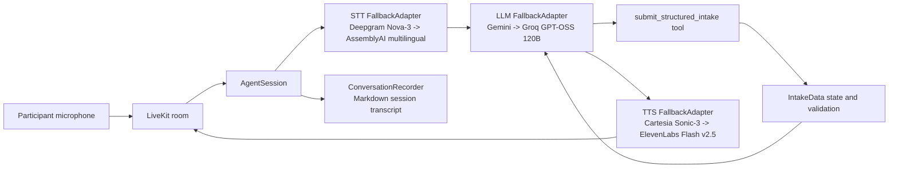

# Bilingual LiveKit Structured Intake Assistant

## Overview

This section implements a real-time Arabic and English voice intake assistant with LiveKit Agents 1.6.7. It collects `full_name`, `phone_number`, `email`, `address`, and `preferred_contact_method`, summarizes the completed intake, and requires explicit confirmation before submission.

The authoritative intake lives in a Pydantic model rather than in chat history. Submission is currently an in-memory validation result; it does not write to a database or external service.

## Demo Videos

> The complete voice assistant demonstrations are available below.

- **Part 1 – Voice Intake Assistant**
  - Covers the complete intake flow, speech recognition, structured data collection, and confirmation.
https://youtu.be/6MsiMYXxE9I

- **Part 2 – Provider Fallback & Production Testing**
  - Demonstrates LLM fallback (Gemini → Groq), STT/TTS behavior, and production testing observations.
https://youtu.be/OsLZO1WR67k

> **Note**
> The demo videos are hosted externally because GitHub's repository file size limit is exceeded by the raw recordings.


## Key Features

- Arabic and English conversation, following the language primarily used by the participant.
- One missing or invalid field requested per turn.
- Deterministic field updates, normalization, completeness checks, and confirmation gating.
- LiveKit function calling for structured intake updates.
- Official LiveKit fallback adapters for STT, LLM, and TTS.
- Markdown recording of real LiveKit sessions under `examples/`.
- Offline unit and lifecycle tests that require no API keys or network calls.

## Architecture



`app.py` registers one RTC entrypoint. Each dispatched session validates configuration, creates fresh provider chains, creates a fresh `StructuredIntakeAgent`, attaches the recorder and metrics callback, starts the room session, and awaits the initial greeting.

### Provider order and policy

| Modality | Primary | Fallback | Adapter policy |
| --- | --- | --- | --- |
| STT | Deepgram `nova-3`, `multi` | AssemblyAI `universal-streaming-multilingual` | 10 s attempt timeout, one retry per provider, 5 s retry interval |
| LLM | Google `gemini-3.5-flash-lite` | Groq `openai/gpt-oss-120b` | 5 s attempt timeout, no per-provider retries, 0.5 s interval, no retry after output starts |
| TTS | Cartesia `sonic-3` | ElevenLabs `eleven_flash_v2_5`, configured voice ID | One retry per provider |

Availability changes are logged from the official adapter events using provider labels only. Credentials and participant data are not logged by this integration.

## Conversation Flow

1. Greet the participant and offer Arabic or English.
2. Ask for only the next missing or unclear field.
3. Update only values explicitly supplied to the tool; preserve omitted fields.
4. Repeat ambiguous values and request clarification instead of guessing.
5. Summarize all five fields and request explicit confirmation.
6. Reject submission when confirmation is absent or required fields remain missing.
7. Submit only after confirmation and report success only when the tool succeeds.
8. If a field changes after confirmation, update that field and request confirmation again.

## State Machine Design

```text
Collect or correct fields
        |
        v
Normalize through IntakeData
        |
        v
Check ordered missing fields
        |
        +-- confirmed=False ----------------> confirmation required
        |
        +-- confirmed=True + incomplete ----> reject with field names
        |
        `-- confirmed=True + complete ------> submit_intake result
```

Deterministic state avoids reconstructing business-critical data from probabilistic chat history. Pydantic trims surrounding whitespace and converts blank strings to `None`. Tool processing preserves the same state object, modifies only supplied fields, and returns a fixed dictionary shape. This limits inconsistent data after interruptions and corrections. Current validation checks presence, not email syntax, phone format, address quality, or allowed contact-method values.

## Project Structure

```text
section-1-livekit/
|-- app.py                    # AgentServer and RTC entrypoint
|-- agent.py                  # Agent state and LiveKit function-tool wrapper
|-- config.py                 # Environment loading and startup validation
|-- conversation_recorder.py  # Real-session Markdown recorder
|-- intake.py                 # IntakeData and SubmissionResult
|-- prompts.py                # Bilingual conversation policy
|-- runtime.py                # Provider and fallback-adapter factories
|-- tools.py                  # Deterministic intake processing
|-- examples/                 # Latest and timestamped session recordings
|-- tests/                    # Offline unit and lifecycle tests
|-- .env.example
|-- requirements.txt
`-- README.md
```

## Prerequisites

- Python 3.12.
- A LiveKit project and a separate LiveKit-compatible participant client.
- Deepgram, AssemblyAI, Google, Groq, Cartesia, and ElevenLabs accounts with access to the configured models.
- Linux, macOS, or WSL for the commands below.

## Installation

From the repository root:

```bash
cd section-1-livekit

python -m venv .venv
source .venv/bin/activate

pip install -r requirements.txt
cp .env.example .env
```

Replace every placeholder in `.env`. Do not commit or share that file.

## Environment Variables

All variables are required. `config.py` loads the local `.env` with `override=False`, so already-exported shell values take precedence. Missing primary or fallback configuration fails at startup with the environment-variable name and affected provider, without exposing secret values.

| Variable | Purpose |
| --- | --- |
| `LIVEKIT_URL` | LiveKit project WebSocket URL |
| `LIVEKIT_API_KEY` | LiveKit project API key |
| `LIVEKIT_API_SECRET` | LiveKit project API secret |
| `DEEPGRAM_API_KEY` | Primary STT credential |
| `ASSEMBLYAI_API_KEY` | Fallback STT credential |
| `GOOGLE_API_KEY` | Primary LLM credential |
| `GROQ_API_KEY` | Fallback LLM credential |
| `CARTESIA_API_KEY` | Primary TTS credential |
| `ELEVENLABS_API_KEY` | Fallback TTS credential |
| `ELEVENLABS_VOICE_ID` | ElevenLabs fallback voice ID |

Values are trimmed and blank values are rejected. Secret fields are excluded from the `Settings` representation.

## How to Run

```bash
cd section-1-livekit

python -m venv .venv
source .venv/bin/activate

pip install -r requirements.txt

set -a
source .env
set +a

python app.py start
```

The worker waits for a LiveKit dispatch. Join the assigned room with an external participant client to provide microphone audio. There is no fake conversation runner.

## How to Test

```bash
cd section-1-livekit
source .venv/bin/activate
python -m pytest -q
```

Tests construct providers and adapters locally or replace them with deterministic fakes. They do not contact provider APIs.

## Example Interaction

```text
Assistant: Hello. You may speak Arabic or English. What is your full name?
User: May Mohammad.
Assistant: What phone number should I use?
User: +20 101 289 0137.
...
Assistant: I have May Mohammad, [phone], [email], [address], and email as your
           preferred contact method. Do you explicitly confirm these details?
User: Change the phone number to +20 110 289 0137.
Assistant: I updated the phone number. Please confirm the complete summary again.
User: Yes, I confirm.
Assistant: [Reports success only after the tool returns success.]
```

The exact wording is model-generated; the sequence reflects the prompt and deterministic tool behavior.

## Design Decisions and Trade-offs

- **LiveKit:** supplies real-time room transport, session lifecycle, function tools, metrics, and provider integrations without custom media orchestration.
- **Official fallback adapters:** preserve standard LiveKit stream semantics and recovery behavior. Small provider factories keep order and configuration easy to test.
- **Provider flexibility:** separate STT, LLM, and TTS providers can be replaced independently. Compared with one realtime API, this adds credentials, network boundaries, rate-limit interactions, and possible failover latency.
- **Fresh session ownership:** each dispatched session creates fresh adapters and one agent-owned state object, preventing cross-session state leakage.
- **Deterministic state:** structured state is more auditable and testable than relying on LLM recall. The LLM still decides when and with which arguments to call the tool.
- **Shortcuts:** submission is not persistent; validation is presence-based; provider models and fallback policies are code constants; no participant UI or token service is included.

## Assumptions

- LiveKit room access and dispatch are configured outside this repository.
- Provider accounts can access the exact models listed above.
- Deepgram `multi`, AssemblyAI multilingual streaming, and Cartesia's automatic language behavior are suitable for Arabic and English input/output.
- One agent instance serves one intake session.
- The LLM follows the prompt and sets `confirmed=True` only after presenting the full summary and receiving explicit confirmation.

## Known Limitations

- Successful submission is not persisted or transmitted.
- There is no formal email, phone, address, or contact-method format validation.
- Free-tier quotas, concurrency limits, and rate limits can exhaust both providers in a chain; fallback improves resilience but does not guarantee availability.
- Failover can add the configured timeout and retry delay to a voice turn.
- ElevenLabs fallback quality and language coverage depend on the configured voice ID; select a voice suitable for both Arabic and English.
- Cartesia retains its existing implicit voice selection.
- No automated end-to-end provider audio test is included.
- Session recordings contain intake data and must be protected appropriately in a production deployment.

## Observations

During testing, both Gemini 3.5 Flash Lite and Groq were integrated through a fallback architecture.

While Gemini served as the primary LLM, I observed that Groq consistently produced faster and more natural conversational responses in this voice-assistant workflow. In particular:

- More responsive turn-taking during real-time conversations.
- Lower perceived latency.
- More concise responses that fit spoken interactions better.

Based on these experiments, I would consider Groq as the preferred primary LLM for latency-sensitive voice assistants, while Gemini remains a strong alternative with seamless failover support.


## Half-Page Technical Write-up

This implementation separates probabilistic conversation behavior from deterministic intake state. LiveKit Agents 1.6.7 provides the real-time session boundary: an `AgentServer` registers one RTC entrypoint, creates a fresh `AgentSession` for each dispatch, and connects three ordered provider chains. Speech recognition uses Deepgram Nova-3 with AssemblyAI multilingual streaming as fallback. Language generation uses Google Gemini with Groq GPT-OSS 120B as fallback, retaining function calling for the structured intake tool. Speech synthesis uses Cartesia Sonic-3 with ElevenLabs Flash v2.5 as fallback. The official LiveKit adapters provide stream-aware failure handling, bounded retries, and availability events without custom exception orchestration.

The authoritative intake is not reconstructed from chat history. `StructuredIntakeAgent` owns an `IntakeData` Pydantic model containing the five required fields. Its LiveKit function tool is a thin asynchronous wrapper around a deterministic Python function. That function applies only non-`None` arguments, reuses Pydantic normalization, preserves omitted values and state identity, and returns a fixed result containing success, message, missing fields, and confirmation requirements. An unconfirmed call may update state but cannot submit. A confirmed incomplete call returns ordered missing fields, while a confirmed complete call reaches the current in-memory submission stub.

This architecture favors testability and provider flexibility. Each provider and adapter is built by a small factory, and unit tests verify order and policy without network calls. Compared with a single-provider realtime API, the design introduces more credentials, network boundaries, quota interactions, and possible failover latency. The ElevenLabs fallback model is multilingual, while pronunciation quality still depends on the configured voice. Production work would add format validation, encrypted persistence, access controls for recordings, consent and audit records, a participant client and token service, and end-to-end multilingual failure testing.
