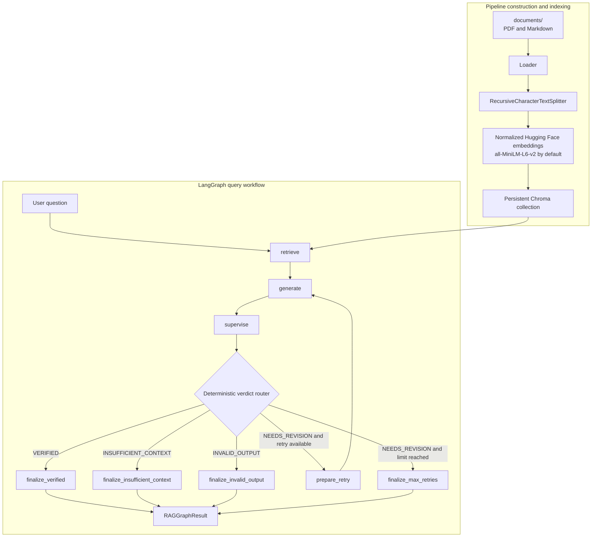

# Grounded RAG Pipeline with LangGraph Verification

## Overview

This section implements a document-grounded Retrieval-Augmented Generation (RAG) system orchestrated with LangGraph. It recursively loads Markdown and PDF documents, splits them into deterministic chunks, stores normalized dense embeddings in persistent Chroma, retrieves semantically similar evidence, and asks Google Gemini to produce a structured answer with chunk citations.

A separate Supervisor reviews the generated answer against the same retrieved evidence. LangGraph then deterministically accepts the answer, requests one bounded revision by default, or terminates with an explicit insufficient-context, invalid-output, or maximum-retries result.

The repository includes a command-line demonstration that builds the real pipeline, accepts user-entered questions, displays results, and overwrites a Markdown report with the actual outputs.

## Demo Videos

https://youtu.be/ZB-TetjOS3o

## Key Features

- Recursive discovery of `.pdf`, `.md`, and `.markdown` documents.
- One LangChain document per PDF page and one per Markdown file.
- Recursive character splitting with preserved source metadata.
- Deterministic chunk IDs in `<source>:<page-or-na>:<index>` format.
- CPU-based, normalized Hugging Face embeddings.
- Persistent Chroma storage with deterministic-ID upserts.
- Ranked dense retrieval with optional maximum-distance filtering.
- Deterministically formatted context containing source, page, distance, and chunk ID.
- Structured Pydantic outputs for retrieval, generation, supervision, and final graph results.
- Grounded Generator prompt with citation validation and prompt-injection defenses.
- Semantic Supervisor plus deterministic structural and domain guardrails.
- Bounded LangGraph revision loop that does not repeat retrieval.
- Explicit insufficient-context and invalid-output results.
- Interactive example runner and automatically generated Markdown report.
- Offline unit tests using fake embeddings and fake language models.

## Architecture



Node responsibilities:

- **`retrieve`:** calls the existing retriever once with the original question, configured `k`, and distance threshold.
- **`generate`:** calls the grounded Generator with the question, typed retrieval result, and optional revision guidance.
- **`supervise`:** runs deterministic Generator guardrails, then asks the Supervisor model to verify claims against retrieved context and validates its structured response.
- **`prepare_retry`:** increments the revision count and converts Supervisor feedback, unsupported claims, and missing evidence into explicitly untrusted review guidance.
- **`finalize_verified`:** returns the latest answer and Generator citations as a verified `COMPLETED` result.
- **`finalize_insufficient_context`:** returns the fixed safe fallback with no citations.
- **`finalize_invalid_output`:** returns a fixed unverified answer after a deterministic structural failure.
- **`finalize_max_retries`:** returns the latest answer and feedback, marked unverified after the revision budget is exhausted.

Finalizer nodes do not call a model or rewrite an answer.

## Graph Workflow

`RAGGraphState` is a `TypedDict` with `question`, `retrieval_result`, `generator_result`, `supervisor_result`, `revision_feedback`, `retry_count`, `max_retries`, and `final_result`.

`run_rag_graph()` trims and validates the question, initializes `retry_count=0`, and invokes the compiled graph. Execution begins with `START → retrieve → generate → supervise`. `route_after_supervision()` then selects an edge solely from the typed Supervisor verdict and retry counters:

| Supervisor verdict | Transition |
| --- | --- |
| `VERIFIED` | `finalize_verified` |
| `INSUFFICIENT_CONTEXT` | `finalize_insufficient_context` |
| `INVALID_OUTPUT` | `finalize_invalid_output` |
| `NEEDS_REVISION` with retries remaining | `prepare_retry → generate` |
| `NEEDS_REVISION` at the retry limit | `finalize_max_retries` |

The default `max_retries=1` means one initial generation plus at most one revision, for a maximum of two Generator calls. Revision reuses the original question and the same `RetrievalResult`; the Retriever is not called again. Supervisor feedback is labelled as review guidance, never as source evidence, and cannot replace the retrieved context.

The public return value is a validated `RAGGraphResult` containing `answer`, `status`, `verified`, `verdict`, `chunk_ids`, `attempts`, and `feedback`. Provider exceptions propagate rather than being converted into an unrelated graph status.

## Project Structure

```text
section-2-rag/
├── app/
│   ├── config.py          # Environment-backed settings and defaults
│   ├── loader.py          # Recursive PDF and Markdown loading
│   ├── splitter.py        # Recursive splitting and chunk metadata
│   ├── vector_store.py    # Embeddings, persistent Chroma, indexing, search
│   ├── retriever.py       # Ranked distance filtering and context formatting
│   ├── generator.py       # Grounded prompt, structured answer, citations
│   ├── supervisor.py      # Semantic review and deterministic guardrails
│   └── graph.py           # LangGraph state, nodes, routing, final results
├── documents/
│   ├── account_support.md
│   ├── data_retention.md
│   └── refund_policy.md
├── data/chroma/           # Persisted Chroma database and index files
├── scripts/run_examples.py# Interactive pipeline demonstration
├── examples/
│   └── example_outputs.md # Automatically generated real pipeline outputs
├── tests/                 # Offline unit and orchestration tests
├── .env.example
├── requirements.txt
└── README.md
```


## Prerequisites

- Python 3.12.
- A Google API key with access to the configured Gemini model.
- Internet access on the first run to obtain the configured Hugging Face embedding model if it is not already cached.
- Sufficient local disk space for dependencies, the embedding model, and the persistent Chroma index.
- Linux, macOS, or WSL for the shell commands below.

## Installation

From the repository root:

```bash
cd section-2-rag

python -m venv .venv
source .venv/bin/activate

pip install -r requirements.txt
cp .env.example .env
```

Replace the placeholder `GOOGLE_API_KEY` in `.env`. Do not commit or disclose the populated file.

## Environment Variables

`app/config.py` loads `section-2-rag/.env`. These are the only environment variables used by this section:

| Variable | Required | Default | Purpose |
| --- | --- | --- | --- |
| `GOOGLE_API_KEY` | Yes for the example runner | Empty | Gemini credential |
| `GEMINI_MODEL` | No | `gemini-3.5-flash` | Generator and Supervisor model |
| `EMBEDDING_MODEL` | No | `sentence-transformers/all-MiniLM-L6-v2` | Local Hugging Face embedding model |
| `CHROMA_PERSIST_DIRECTORY` | No | `section-2-rag/data/chroma` | Persistent Chroma path |
| `CHROMA_COLLECTION_NAME` | No | `supportiq_knowledge_base` | Chroma collection |
| `CHUNK_SIZE` | No | `700` | Recursive splitter chunk size |
| `CHUNK_OVERLAP` | No | `120` | Character overlap between chunks |
| `RETRIEVAL_K` | No | `4` | Maximum retrieved candidates |
| `RETRIEVAL_MAXIMUM_DISTANCE` | No | `1.0` | Inclusive Chroma distance cutoff |

When `CHROMA_PERSIST_DIRECTORY` is relative, it is resolved from the current working directory. The documented command runs from `section-2-rag`, matching `.env.example`. Configuration rejects overlap greater than or equal to chunk size and rejects negative or non-finite retrieval distance thresholds.

## Run

Activate the environment and run the interactive demonstration:

```bash
cd section-2-rag
source .venv/bin/activate
python scripts/run_examples.py
```

The script loads settings, creates or reopens Chroma, recursively loads and splits `documents/`, upserts chunks using deterministic IDs, creates separate Gemini clients for the Generator and Supervisor, compiles the graph, and prompts for a user-selected number of questions.

Initialization failures return a non-zero exit code. If one question fails, the script records the error and continues with the remaining questions.

## Run Tests

The test suite uses temporary Chroma collections, deterministic fake embeddings, fake structured-output models, and dependency injection. It does not require a real Gemini API key.

```bash
cd section-2-rag
source .venv/bin/activate
pytest -q
```

### Test Status

At the time this README was written, the complete unit test suite passed successfully.

```text
183 passed, 1 warning
```

Any reported warning is a third-party dependency deprecation warning (`langchain-community`) and does not affect the implementation.

## Example Output

Every demonstration run creates `examples/` if needed and overwrites `examples/example_outputs.md`; it never appends to an older report. The file begins with an ISO timestamp and records the actual question, answer, graph status, Supervisor verdict, verification flag, attempt count, and citations for each execution. Failed questions are recorded with `ERROR` and the exception message.

The committed report currently contains verified output such as:

```text
Question: How long does an approved refund take?
Answer: Approved refunds are sent to the original payment method within 5 to 10 business days, although processing time can depend on the customer's bank or card provider.
Graph Status: COMPLETED
Supervisor Verdict: VERIFIED
Verified: True
Attempts: 1
Citations:
- refund_policy.md:na:1
```

It also demonstrates `INSUFFICIENT_CONTEXT` with `Verified: False` and no citations for a question not covered by the corpus. Answers in the report were generated by the pipeline rather than hard-coded by the script.

The report is generated from actual graph execution rather than static examples.

## Design Decisions and Trade-offs

- **LangGraph orchestration:** explicit nodes and conditional edges make acceptance, revision, and terminal failure states inspectable and bounded. A sequential function would be smaller but less clear once revision and multiple final outcomes are introduced.
- **Generator/Supervisor separation:** generation optimizes for a useful grounded answer; supervision independently checks claims and citations. This costs an additional Gemini call for each attempt.
- **Deterministic routing and guardrails:** Pydantic validation, citation allow-listing, verdict invariants, and a non-LLM router prevent model output from controlling execution arbitrarily.
- **Single retrieval per question:** retries reuse the same evidence, avoiding retrieval drift and extra embedding work. A poor initial retrieval cannot be repaired by the current revision loop.
- **Explicit insufficient context:** unusable retrieval bypasses Generator inference and returns a fixed fallback. The Supervisor can also identify semantically insufficient evidence.
- **Dense retrieval:** normalized local embeddings and persistent Chroma keep the implementation self-contained. Dense-only search may miss exact identifiers or rare terms, and a fixed distance threshold requires corpus-specific tuning.
- **Deterministic IDs and upserts:** repeated runs update matching chunks without duplicates. The runner does not remove stale IDs when a document is deleted or produces fewer chunks.

## Assumptions

- Source material is UTF-8 Markdown or text-extractable PDF content.
- The corpus is in `section-2-rag/documents/`; this path is not environment-configurable.
- Lower Chroma distance means a closer semantic match.
- Retrieved chunks contain deterministic `chunk_id` metadata before indexing.
- The configured Gemini model supports LangChain structured output for both Pydantic schemas.
- The default one-revision budget is appropriate for the demonstration.
- Source documents are evidence, not trusted instructions.

## Known Limitations

- The included corpus contains only three small Markdown documents.
- Retrieval is dense-only: there is no BM25/hybrid search, reranker, query rewriting, metadata filtering, or parent-document retrieval.
- Revision does not trigger a second retrieval or expand the evidence set.
- Index synchronization uses upserts but has no deletion reconciliation for removed or shortened source documents.
- Execution is synchronous with no streaming, async graph invocation, checkpointing, or human-in-the-loop review.
- There is no web API, authentication, multi-user service layer, or deployment configuration.
- PDF support depends on extractable text; OCR is not implemented.
- The embedding model runs on CPU and may be slow for a larger corpus.
- Dependencies are unpinned in `requirements.txt`, reducing reproducibility across future installations.
- Provider and schema errors propagate; the graph has no retry policy for infrastructure failures.

## Half-Page Technical Write-up

LangGraph was selected because this RAG workflow has explicit conditional behavior rather than a single linear question-answering path. Retrieval and initial generation are sequential, but the Supervisor can accept an answer, request revision, declare the evidence insufficient, or reject structurally invalid output. Representing those outcomes as typed graph state, named nodes, and deterministic conditional edges makes execution auditable and prevents an LLM from choosing control flow directly. The retry counter also makes the revision loop bounded: the default permits one revised generation and then returns a clearly unverified maximum-retries result.

The Generator and Supervisor have separate responsibilities. The Generator receives only the user question, formatted retrieved context, authoritative chunk IDs, and optional review guidance. Its Pydantic output is normalized and checked so a supported answer must be non-blank and cite only retrieved IDs. When retrieval is empty or filtered below the distance threshold, generation returns a deterministic insufficient-context answer without invoking the Generator model. The Supervisor first applies structural guardrails, then uses a separate structured Gemini call to compare every claim with the retrieved evidence. Domain validation enforces consistent verdict flags, meaningful feedback, unique known citations, and the rule that `INVALID_OUTPUT` belongs only to deterministic application checks.

Revision feedback contains the Supervisor explanation, unsupported claims, and missing evidence, but is explicitly labelled as untrusted guidance rather than evidence. The graph reuses the original question and retrieval result, so revision can remove unsupported material without changing the evidence base. This improves predictability, although it cannot recover from poor retrieval.

For a larger collection, the implemented dense Chroma retrieval would benefit from hybrid lexical/vector search, metadata filtering, reranking, and parent-document retrieval. Query rewriting or a bounded second retrieval could address evidence gaps, while deletion-aware indexing would keep persistent state synchronized with the corpus. Streaming, checkpointing, observability, provider-failure policies, and an API boundary would be additional production work; none of those capabilities are implemented here.